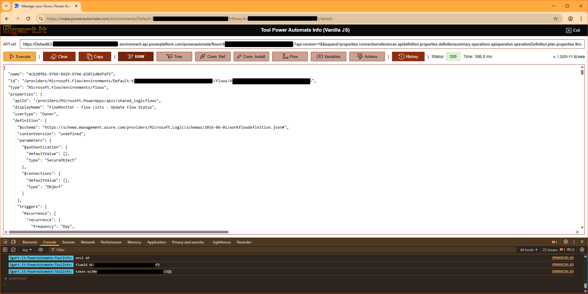

# sgart-vanillajs-sp-api-demo

## SharePoint

JavaScript da iniettare in una pagina SharePoint per testare le chiamate GET alle API. 

[Tool SharePoint API Demo (Vanilla JS)](https://www.sgart.it/IT/informatica/tool-sharepoint-api-demo-vanilla-js/post)

## Power Automate

[Tool Power Automate show info (Vanilla JS)](https://www.sgart.it/IT/informatica/tool-power-automate-show-info-vanilla-js/post)

## Disclaimer

**THIS CODE IS PROVIDED _AS IS_ WITHOUT WARRANTY OF ANY KIND, EITHER EXPRESS OR IMPLIED, INCLUDING ANY IMPLIED WARRANTIES OF FITNESS FOR A PARTICULAR PURPOSE, MERCHANTABILITY, OR NON-INFRINGEMENT.**

